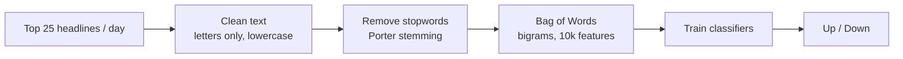

<div align="center">

# 📈 Stock Sentiment Analysis: Dow Jones (DJIA)

**Can today's news headlines predict whether the Dow Jones goes up or down? An NLP experiment on 16 years of news (2000–2016).**


**Best accuracy: 85.98% (Logistic Regression)**

</div>

---

## 📖 Overview

Each row in the dataset is one trading day with the **top 25 world news headlines** and a label:

- **1**: the DJIA closed **up**
- **0**: the DJIA stayed the **same or went down**

The notebook turns the headlines into features with NLP and trains classifiers to predict the market direction.

---

## 🔄 Pipeline



- **Split by time:** train on days **before 2015**, test on **2015 onwards** (3,972 train / 378 test). There's no random shuffling, so the model never sees future news.
- **Word clouds** show which words appear most on up days and down days.

---

## 🏆 Results

| Model | Accuracy | Precision | Recall |
|---|---|---|---|
| 🥇 **Logistic Regression** | **85.98%** | 0.87 | 0.85 |
| 🥈 Random Forest (100 trees, entropy) | 84.13% | 0.81 | 0.89 |
| 🥉 Multinomial Naive Bayes | 83.86% | 0.85 | 0.83 |

Confusion matrices for each model are plotted in the notebook. It also includes a `stock_prediction()` helper that takes any headline and predicts the market direction.

---

## 🚀 Getting Started

```bash
git clone https://github.com/gmgowrish/-Sentiment-Analysis---Dow-Jones-DJIA-Stock-using-News-Headlines.git
cd -- -Sentiment-Analysis---Dow-Jones-DJIA-Stock-using-News-Headlines

pip install numpy pandas matplotlib seaborn nltk scikit-learn wordcloud jupyter
jupyter notebook "Stock Sentiment Analysis.ipynb"
```

> The notebook was written for **Google Colab** and loads the CSV from Google Drive. To run it locally, change the path in the loading cell to:
> ```python
> df = pd.read_csv('Stock Headlines.csv', encoding='ISO-8859-1')
> ```
> and skip the `drive.mount` cell.

---

## 📁 Files

| File | Description |
|---|---|
| `Stock Headlines.csv` | 4,101 trading days × top 25 headlines + label |
| `Stock Sentiment Analysis.ipynb` | Full analysis, models and evaluation |

## 🛠️ Tech Stack

**Python** · **Pandas** · **NLTK** (stopwords, Porter stemmer) · **scikit-learn** (CountVectorizer, LogisticRegression, RandomForest, MultinomialNB) · **Matplotlib / Seaborn** · **WordCloud**

---

> ⚠️ For learning purposes only. This is not financial advice.

<div align="center">

Made by **[G M Gowrish](https://github.com/gmgowrish)** · ⭐ Star the repo if you find it useful!

</div>
